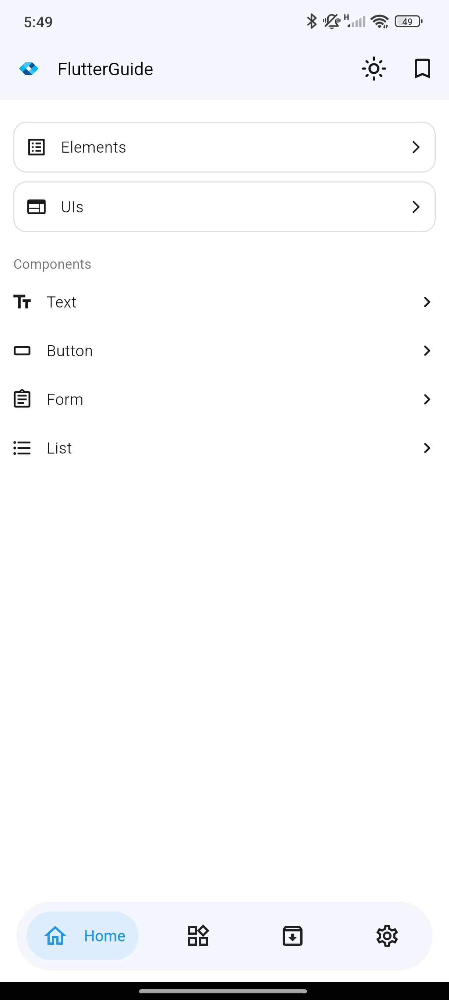
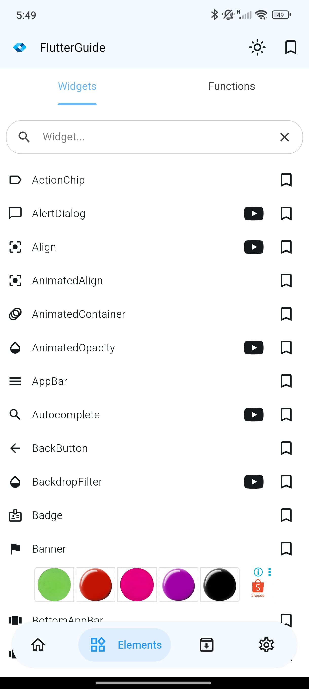
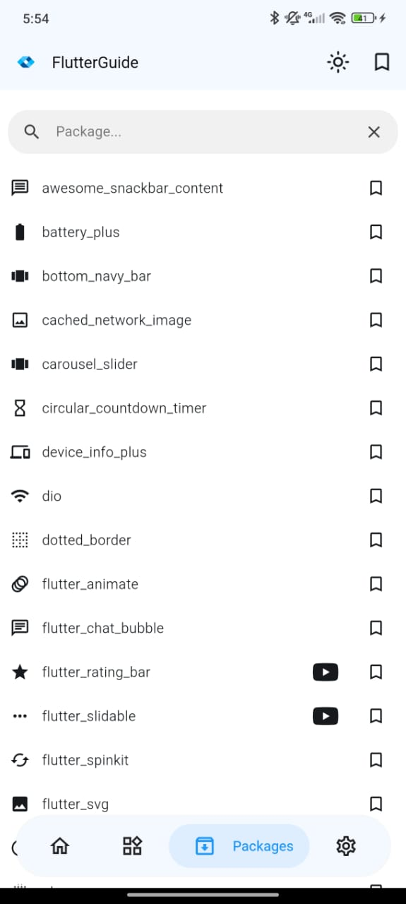
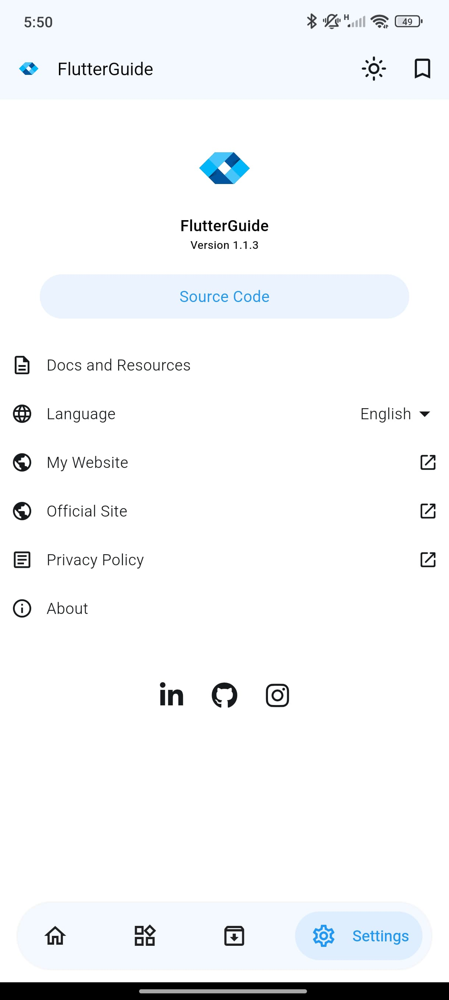
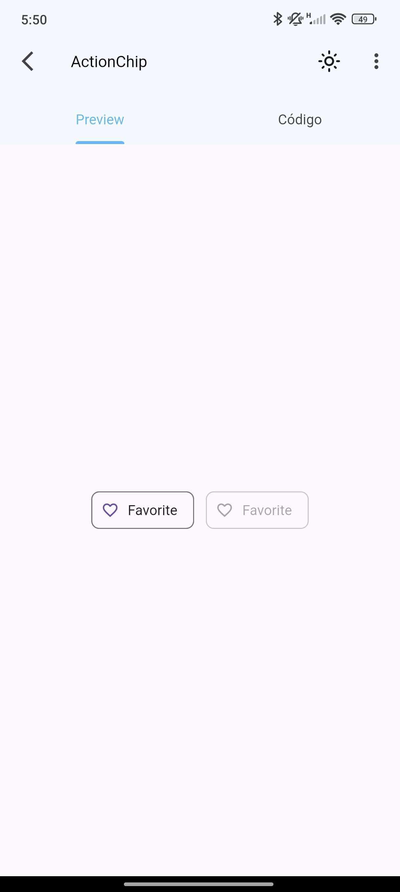
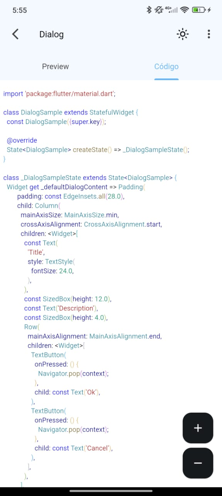

<br>
<div align="center">
  
  
  
  
</div>
<br>

<h1 align="center">Flutter Guide – Official Website</h1>

<p align="center">
  Official website of the Flutter Guide mobile application, built with Next.js, TypeScript, and Tailwind CSS.
  <br>
  <a href="#about-the-project"><strong>Explore the docs »</strong></a>
  <br>
  <br>
  <a href="https://flutter-guide-web.vercel.app/">View Live Version</a>
  ·
  <a href="https://github.com/dariomatias-dev/flutter_guide_web/issues">Report Bug</a>
  ·
  <a href="https://github.com/dariomatias-dev/flutter_guide_web/issues">Request Feature</a>
</p>

## Table of Contents

- [About The Project](#about-the-project)
- [Features](#features)
- [Built With](#built-with)
- [Getting Started](#getting-started)
- [Screenshots](#screenshots)
- [Download the App](#download-the-app)
- [Contributing](#contributing)
- [License](#license)
- [Author](#author)

## About The Project

This is the repository for the official website of the Flutter Guide mobile app.  
Its purpose is to showcase the application, present its main features, display screenshots, and provide a direct download link.

**Note**: This repository contains only the code for the official landing page.  
The source code for the Flutter mobile application is available in a separate repository.

## Features

- **Comprehensive Content:** Access a wide range of tutorials and guides covering various aspects of Flutter development.  
- **Categorized Information:** Content is organized into logical categories for easy navigation and learning.  
- **Code Snippets:** Includes practical code examples to help understand and implement Flutter concepts.  
- **Responsive Design:** Fully responsive for a great experience on all devices.  

## Built With

This project was developed using the following core technologies:

- **[React](https://reactjs.org/)** – A JavaScript library for building user interfaces.
- **[Next.js](https://nextjs.org/)** – A React framework optimized for performance and SEO.
- **[TypeScript](https://www.typescriptlang.org/)** – A typed superset of JavaScript that compiles to plain JavaScript.
- **[Tailwind CSS](https://tailwindcss.com/)** – A utility-first CSS framework for rapid UI development.
- **[shadcn/ui](https://ui.shadcn.com/)** – Reusable components built using Radix UI and Tailwind CSS.
- **[Embla Carousel](https://www.embla-carousel.com/)** – Lightweight and performant carousel library.

## Getting Started

To get a local copy up and running, follow these simple steps.

### Prerequisites

Ensure you have Node.js and a package manager (pnpm) installed on your machine.

- Node.js
- pnpm

### Installation

Clone the repository:

```bash
git clone https://github.com/dariomatias-dev/flutter_guide_web.git
````

Navigate into the project directory:

```bash
cd flutter_guide_web
```

Install the required packages:

```bash
pnpm install
```

### Running The Project

To run the development server:

```bash
pnpm run dev
```

Open [http://localhost:3000](http://localhost:3000) in your browser to view the result.

## Screenshots

<div align="center">
  
  
  
  
  
  
</div>

## Download the App

Get **Flutter Guide** directly from the **Google Play Store**:

<a href="https://play.google.com/store/apps/details?id=com.dariomatias.flutter_guide" target="_blank">
  
</a>

## Contributing

Contributions make the open-source community an amazing place to learn and create.
Any contributions you make are greatly appreciated.

To get started:

1. **Fork the Project**
2. **Create your Feature Branch**

   ```sh
   git checkout -b feature/AmazingFeature
   ```

3. **Commit your Changes**

   ```sh
   git commit -m 'Add some AmazingFeature'
   ```

4. **Push to the Branch**

   ```sh
   git push origin feature/AmazingFeature
   ```

5. **Open a Pull Request**

## License

Distributed under the **MIT License**. See the [LICENSE](LICENSE) file for more information.

## Author

Developed by **Dário Matias**:

- **Portfolio**: [dariomatias-dev](https://dariomatias-dev.com)
- **GitHub**: [dariomatias-dev](https://github.com/dariomatias-dev)
- **Email**: [matiasdario75@gmail.com](mailto:matiasdario75@gmail.com)
- **Instagram**: [@dariomatias_dev](https://instagram.com/dariomatias_dev)
- **LinkedIn**: [linkedin.com/in/dariomatias-dev](https://linkedin.com/in/dariomatias-dev)
